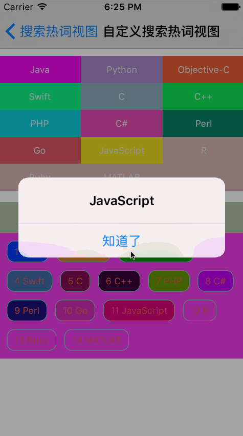

# SYHotSearchView
搜索热词自定义多样式视图

* 可以根据实际需要自定义样式
  * 九宫格显示，根据字符串长度自适应显示；
  * 设置显示的字体颜色，高亮时的字体颜色；
  * 字体大小；
  * 背景颜色，高亮时的背景颜色等特性；
  * 边框样式：颜色，粗细，圆角特性；

```
/// 是否显示标题标签（默认：不显示标签，也不显示图标）
@property (nonatomic, assign) BOOL showHotSearchLabel;

/// 标题标签（自定义字体：大小、颜色、背景色、对齐方式。默认透明背景色，12号黑色字体，左对齐）
@property (nonatomic, strong) UILabel *hotSearchLabel;

/// 标题图标（默认：无图标）
@property (nonatomic, strong) UIImage *hotSearchImage;

/// 是否九宫格样式显示，或自适应样式显示（默认：九宫格）
@property (nonatomic, assign) BOOL isHotSearchStyleNinePatch;

/// 是否排序显示（默认：不排序）
@property (nonatomic, assign) BOOL isHotSearchSort;

/// 热词标签边框颜色（默认：灰色，非九宫格才有效）
@property (nonatomic, strong) UIColor *hotSearchBorderColor;

/// 热词标签边框圆角（默认：5.0，非九宫格才有效）
@property (nonatomic, assign) CGFloat hotSearchCornerRadius;

/// 热词标签边框大小（默认：0.5，非九宫格才有效）
@property (nonatomic, assign) CGFloat hotSearchBorderWidth;
 
/// 热词标签字体（默认：12）
@property (nonatomic, strong) UIFont *hotSearchTextFont;

/// 热词标签字体常规颜色（默认：黑色）
@property (nonatomic, strong) UIColor *hotSearchTextNormalColor;
 
/// 热词标签字体高亮颜色（默认：无）
@property (nonatomic, strong) UIColor *hotSearchTextHighlightColor;

/// 热词标签背景常规颜色组（默认：无）
@property (nonatomic, strong) NSArray *hotSearchTextNormalBackgroundColors;
 
/// 热词标签背景高亮颜色组（默认：无）
@property (nonatomic, strong) NSArray *hotSearchTextHighlightBackgroundColors;


/// 数据源
@property (nonatomic, strong) NSArray *hotSearchWords;

/// 响应回调
@property (nonatomic, copy) void (^ hotSearchTextClick)(NSString *hotSearchText);

/// 刷新UI
- (void)reloadData;
```

代码示例
```
// 导入头文件
#import "SYHotSearch.h"

// 实例化
SYHotSearchView *hotView = [[SYHotSearchView alloc] initWithFrame:CGRectMake(0.0, 200.0, CGRectGetWidth(self.view.bounds), 40.0)];
// 添加到父视图
[self.view addSubview:hotView];
hotView.backgroundColor = SYHotSearchRandomColor;
// 显示热词搜索标题
hotView.showHotSearchLabel = YES;
hotView.hotSearchLabel.textAlignment = NSTextAlignmentCenter;
hotView.hotSearchLabel.text = @"热门搜索词";
hotView.hotSearchLabel.font = [UIFont systemFontOfSize:20.0];
hotView.hotSearchLabel.textColor = SYHotSearchRandomColor;
hotView.hotSearchLabel.backgroundColor = SYHotSearchRandomColor;
hotView.hotSearchImage = [UIImage imageNamed:@"normalImage"];
// 热词显示样式是否九宫格
hotView.isHotSearchStyleNinePatch = NO;
// 热词边框样式
hotView.hotSearchBorderColor = SYHotSearchRandomColor;
hotView.hotSearchCornerRadius = 10.0;
hotView.hotSearchBorderWidth = 1.0;
// 热词排序
hotView.isHotSearchSort = YES;
// 热词字体颜色
hotView.hotSearchTextNormalColor = SYHotSearchRandomColor;
hotView.hotSearchTextHighlightColor = SYHotSearchRandomColor;
// 热词背景颜色
hotView.hotSearchTextNormalBackgroundColors = @[SYHotSearchRandomColor,SYHotSearchRandomColor,SYHotSearchRandomColor,SYHotSearchRandomColor,SYHotSearchRandomColor,SYHotSearchRandomColor,SYHotSearchRandomColor,SYHotSearchRandomColor,SYHotSearchRandomColor,SYHotSearchRandomColor,SYHotSearchRandomColor];
hotView.hotSearchTextHighlightBackgroundColors = @[SYHotSearchRandomColor,SYHotSearchRandomColor,SYHotSearchRandomColor,SYHotSearchRandomColor,SYHotSearchRandomColor,SYHotSearchRandomColor,SYHotSearchRandomColor,SYHotSearchRandomColor,SYHotSearchRandomColor,SYHotSearchRandomColor,SYHotSearchRandomColor,SYHotSearchRandomColor,SYHotSearchRandomColor,SYHotSearchRandomColor,SYHotSearchRandomColor];
// 数据源
hotView.hotSearchWords = @[@"Java", @"Python", @"Objective-C", @"Swift", @"C", @"C++", @"PHP", @"C#", @"Perl", @"Go", @"JavaScript", @"R", @"Ruby", @"MATLAB"];
// 选择点击回调
hotView.hotSearchTextClick = ^(NSString *text){
    [[[UIAlertView alloc] initWithTitle:nil message:text delegate:nil cancelButtonTitle:nil otherButtonTitles:@"知道了", nil] show];
};
// 刷新数据
[hotView reloadData];

```

效果图


